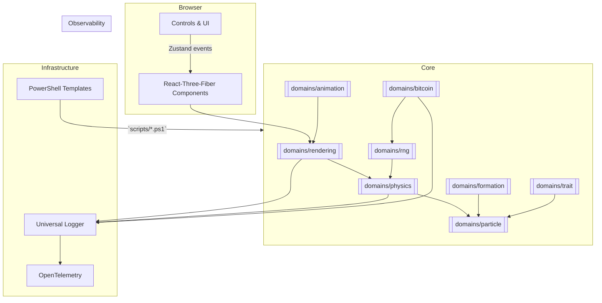

# Architecture Overview

## 1. High-Level Component Diagram



> Diagram generated with Mermaid; run the markdown preview in VS Code for an interactive view.

## 2. Data-Flow

1. **Block Fetch** – `BitcoinService` fetches `/r/blockinfo/{blockNumber}` and seed entropy.
2. **Random Initialisation** – `RNGService` sprays a deterministic seed into `FormationService` and `TraitService`.
3. **Particle Generation** – `FormationService` arranges `N` particles; each particle receives trait-driven visual & behavioural properties.
4. **Simulation Loop** – `PhysicsService` integrates forces at 60 fps, updating the Zustand store.
5. **Rendering** – `RenderingService` subscribes to store changes, updates Three.js geometries via React-Three-Fiber.
6. **Evolution** – Every new Bitcoin block triggers `TraitService` mutations → particle re-initialisation.

## 3. Deployment Topology

| Component                 | Location                         |
| ------------------------- | -------------------------------- |
| Static assets + JS bundle | CDN / GitHub Pages               |
| Ordinals client           | User-run Node or remote endpoint |
| OpenTelemetry Collector   | Optional side-car                |

_No centralised backend is required – the simulation is deterministic from on-chain data._

## 4. Template-First Workflow

1. **Author** a new template in `templates/` (e.g. `templates/domains/formation/data/mySpiral.ts.template`).
2. **Run** appropriate PowerShell scaffold script (e.g. `scripts/44a-AddFormationTemplate.ps1`).
3. **Script** copies template → `src/domains/formation/data/` & updates exports.
4. **Documentation** – update `docs/domain-guides/formation.md` and `templates-system.md`.

## 5. Layered Source Layout

```text
src/
  assets/              # Static CSS, themes, images
  components/          # React components (client)
  domains/             # Business logic, organised by domain
  shared/              # Cross-domain helpers (logger, config, workers)
  state/               # Zustand stores generated per domain
  compositionRoot.ts   # Service singleton initialisation
  main.tsx             # React entrypoint
```

## 6. Cross-Cutting Concerns

- **Logging** – services call `logger.info|debug|error` with contextual metadata.
- **Error-handling** – network retries (3×) with exponential back-off in `BitcoinService`.
- **Performance** – Physics uses object pools & lazy instancing, frame-budget enforced by `requestAnimationFrame` + delta time clamping.
- **Testing** – every public method has Vitest unit tests; per-domain integration tests; e2e spec with Playwright.
- **CI/CD** – Husky pre-commit hooks + GitHub Actions run lint, type-check, tests, bundle-size check.

---

For naming rules & directory nitty-gritty see `[naming-conventions.md](./naming-conventions.md)` and `[directory-structure.md](./directory-structure.md)`.
